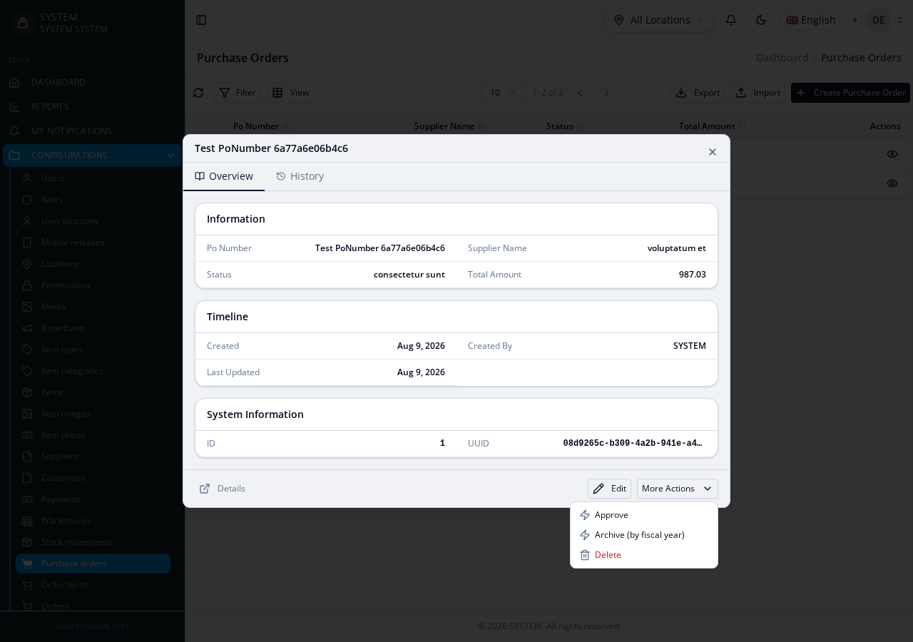
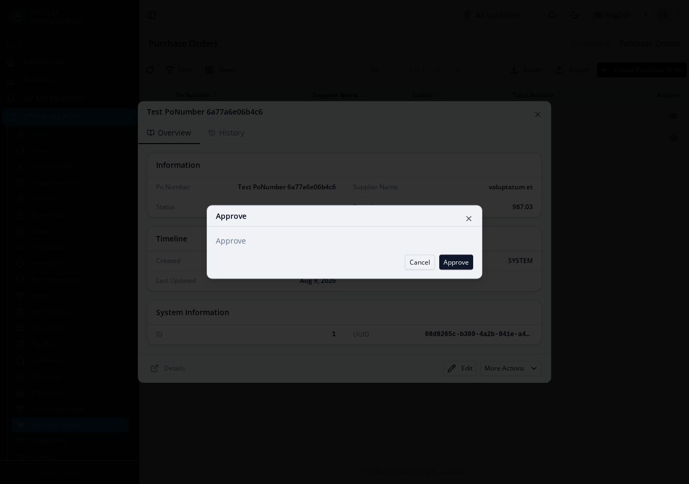
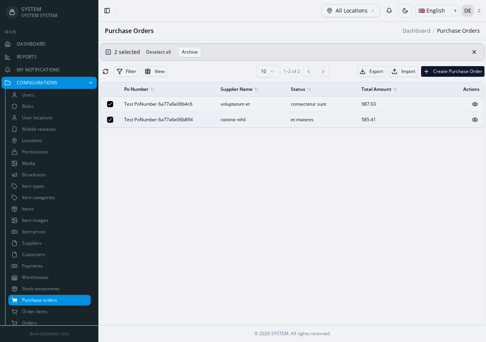

# Custom Actions & Bulk Actions

A state-transition button (Approve, Reject, Mark Received) that isn't part
of ordinary create/edit/delete — either a single-record action, or a
list-level bulk action applied to many selected records at once. These are
**two separate, unrelated mechanisms** that happen to share the word
"action" — don't confuse them.

**Reference fixture:**
[`actions-suite`](https://github.com/joelnjoshkibona/generator-engine/tree/main/tests/Fixtures/integration-schemas/actions-suite) —
`PurchaseOrders`.

For the full config shapes, see the [Actions reference](../actions) (single
custom actions) and [Features Config reference](../features-config#features-backend-list)
(`bulk_actions`/`export`/`import`, nested under `features.backend.list`).

## Single custom action — `actions` config key, hand-authored

```json
"actions": {
  "approve": {
    "name": "approve",
    "label": "Approve",
    "hasUI": true,
    "uiType": "modal",
    "urlParams": ["uuid"],
    "operations": {
      "create": {"enabled": true, "endpoint": {"method": "POST", "path": "/purchase-orders/{uuid}/approve"}}
    }
  }
}
```

Regenerate with `--force`, then **hand-fill the actual logic** in
`Services/PurchaseOrdersApproveService.php`'s `process()` method — starts as
a literal `// Add your custom logic here` stub, and since v3.1.7 the file is
written via `writeFileOnce()`, so your hand-fill survives every later
`--force` regenerate of this module untouched:

```php
protected static function process(array $data, string $uuid, array $params = []): array
{
    $model = PurchaseOrdersModel::where('uuid', $uuid)->firstOrFail();
    $model->update(['status' => 'approved']);
    return Helpers::success($model->fresh(), 'Purchase order approved');
}
```

Add `fields[]` (and, for a multi-step flow, `wizard`/`confirm_step`) to the
`actions.approve` config to have the generated Form.vue arrive pre-populated
with real inputs instead of a blank stub — see the [Actions reference](../actions)
for the full field shape. `Form.vue` is also `writeFileOnce()`-protected.

You also get a real route (`POST /purchase-orders/{uuid}/approve`,
permission `PurchaseOrders.approve`) and — since `hasUI: true` — a generated
form, plus a button wired into the view page — both custom actions this
fixture defines (`approve`, `archiveByYear`) show up under "More Actions" on
the record's view modal:



Clicking "Approve" opens the generated modal — real fields, wired to the
real route above:



You also get a generated PHPUnit contract test (route registered + requires
its permission, and the placeholder body never hard-fails) — but only when
`urlParams` is `[]` (the default route shape) or exactly `['uuid']`, as in
this example. Any other shape — multiple params, or a param name other than
`uuid` — silently produces zero test methods for that action, with no
warning at generation time (`PhpUnitTestGenerator::buildActionServiceTestMethodsForKey()`,
since v2.44.0; before that fix, `['uuid']` itself was also uncovered — see
[Gotchas](gotchas)). If backend test coverage matters for a multi-param
action, write the contract test by hand.

## Bulk action — a different, nested config location

`features.backend.list.bulk_actions`, **not** part of `actions` at all, no
shared shape:

```json
{"features": {"backend": {"list": {"bulk_actions": [
  {"key": "archive", "label": "Archive"}
]}}}}
```

This emits `Services/PurchaseOrdersArchiveService.php` with a **static**
`execute(array $data, array $params): array` — the same static calling
convention the single-action mechanism uses too (`ProductsApproveService::execute()`
above is also `static`); the two mechanisms differ only in signature
(`$data, $params` here vs. `$data, ...$urlParams, $params = []` for a
single action with `urlParams`), not in static-vs-instance. Without a
`status_target`, it's the same kind of empty TODO stub as a single action.

Since v2.29.0 this also renders a real bulk-action toolbar in the generated
`PurchaseOrdersListPage.vue` — it appears once one or more rows are
selected, dispatches to the always-present `POST /purchase-orders/bulk-action`
route, and is gated by `PurchaseOrders.bulkAction`:



The sibling
`features.backend.list.export`/`.import` keys get the same treatment (a
real export button, a real import dialog) — see
[Features Config › Frontend wiring for bulk actions, export, and import](../features-config#frontend-wiring-for-bulk-actions-export-and-import)
for the full picture, including the `actions-suite` fixture's own
`export: true`/`import: true` config.

## Gotcha — `status_target` always writes to a `status_id` column, whatever your real column is named

```php
// what status_target => 'RECEIVED' actually generates:
$model->update(['status_id' => PurchaseOrdersModel::RECEIVED]);
```

`BulkActionServiceGenerator::buildActionBody()` **hardcodes the column name**
`status_id` — it is not derived from your schema. The referenced constant
comes from a completely separate top-level `constants` config key:

```json
{"constants": {"RECEIVED": 3}}
```

`constants` itself is not numeric-only — it's a flat `{NAME: value}` map
emitted verbatim as `public const NAME = value;` (numeric values unquoted,
everything else quoted as a PHP string), so `{"RECEIVED": "RECEIVED"}` works
identically well as a constant. **The break is the column, not the
constant's type**: `status_target` against this fixture's plain string
`status` column (deliberately used here to stay self-contained) generates a
reference to a `status_id` column that doesn't exist, regardless of what
value the constant holds. If your module's status column isn't literally
named `status_id`, skip `status_target` and hand-fill the transition
yourself, same as a single custom action.

## Gotcha — `bulk_actions`/`export`/`import` need the same `--force`-survival care as `inline_items`

They live at *nested* config paths (`features.backend.list.bulk_actions`,
`.export`, `.import`), which the consuming project's
`ModuleScaffolder::mergePersistedFields()` did not originally cover.
Confirmed live while building this fixture: a `--force` regenerate silently
dropped a hand-added `bulk_actions` entry entirely while the sibling
top-level `actions` key correctly survived the same regenerate. Fixed in
the same pass — see [Gotchas](gotchas). `export`/`import` were added to
this fixture later (v2.29.0) and got the preserved-fields fix proactively,
before either could reproduce the same bug a third time.

See the fixture's own
[README](https://github.com/joelnjoshkibona/generator-engine/tree/main/tests/Fixtures/integration-schemas/actions-suite)
for the full verification steps.
