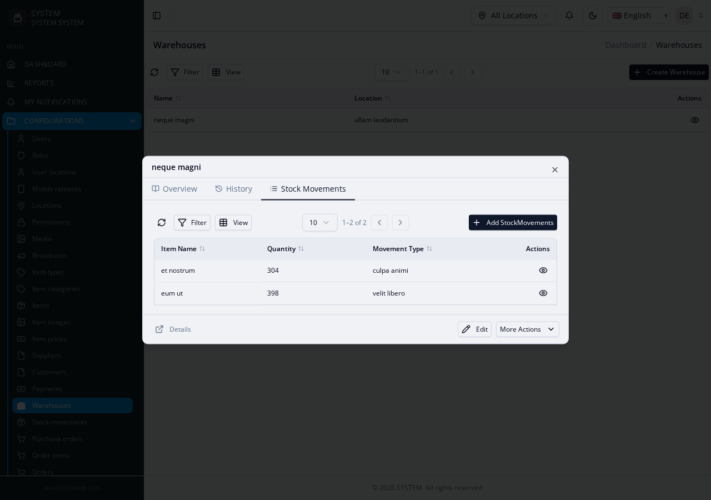

# Related-Record Tabs (`delegations`)

A module's view page shows a **different, independently-addressable**
module's records, scoped to it — e.g. a Warehouse's view page has a "Stock
Movements" tab showing every movement recorded against that warehouse.
Different from [`inline_items`](inline-items): a delegation's child rows
are **not** synced from the parent's own form submit — the child module has
its own full, independent CRUD (its own routes, controller, list page if
you navigate to it directly); the parent's view page just embeds a scoped
view of it.

**Reference fixture:**
[`delegations-suite`](https://github.com/joelnjoshkibona/generator-engine/tree/main/tests/Fixtures/integration-schemas/delegations-suite) —
`Warehouses`/`StockMovements`.

For the full `delegations` config shape, see the
[Delegations reference](../delegations).

## Building it

Follow the [generate → hand-edit → regenerate loop](index#the-generate-hand-edit-regenerate-loop):

1. Generate both modules normally — `StockMovements` needs nothing special:
   ```bash
   php artisan make:module Custom/Warehouses
   php artisan make:module Custom/StockMovements
   ```
2. Hand-edit `Warehouses`' `module.json`, adding a `delegations` entry:
   ```json
   "delegations": {
     "stockMovements": {
       "name": "StockMovements",
       "label": "Stock Movements",
       "uiType": "tab",
       "relatedModule": {"name": "StockMovements", "group": "Custom"},
       "filterKey": "warehouse_id",
       "parentKey": "uuid",
       "parentIdField": "id",
       "operations": {
         "list":   {"enabled": true},
         "create": {
           "enabled": true,
           "backend":  {"fields": [
             {"field": "item_name", "rules": "required|string|max:255"},
             {"field": "quantity", "rules": "required|integer"}
           ]},
           "frontend": {"fields": [
             {"field": "item_name", "label": "Item", "field_type": "input", "type": "text", "required": true},
             {"field": "quantity", "label": "Quantity", "field_type": "number-input", "type": "number", "required": true}
           ]}
         },
         "view":   {"enabled": true},
         "delete": {"enabled": true}
       }
     }
   }
   ```
   `list` almost always leaves `frontend.fields` empty — the generated tab
   falls back to the **related module's own** persisted `module.json`
   `features.frontend.list.fields` for its columns. `create`/`edit` don't
   get that fallback: you must supply `frontend.fields` (the form) **and**
   `backend.fields` (the validation rules) — two separate things. Skipping
   `backend.fields` doesn't error; it silently validates away every
   submitted field except the parent FK and audit columns, because
   Laravel's `validate()` only returns declared rule keys. Confirmed the
   hard way while building this fixture — see [Gotchas](gotchas).
3. Regenerate with `--force`:
   ```bash
   php artisan make:module Custom/Warehouses --force
   ```

## What you get

A real nested backend endpoint per enabled operation
(`GET /warehouses/{uuid}/stock-movements/list`, etc.), a
`WarehousesStockMovementsService.php` scoping every query by
`warehouse_id = $parent->id`, and a `WarehousesStockMovementsTab.vue` wired
into both the view modal's tabs and the details page's nested route.

A Warehouse's own view page — Overview / History / **Stock Movements**, the
third tab entirely from this one `delegations` entry — with its own
independent toolbar (filter, column view, pagination, its own "Add Stock
Movements" button) scoped to just this warehouse's rows:



## Fixed (2026-08-05) — delegation and standalone access now share one form, safely

Earlier versions of the generator wrote the related module's own
`CreateForm.vue`/`EditForm.vue` a second time, into that module's single
canonical `Components/` path — the same file its own independent scaffold
already wrote — with a field list that deliberately excluded the parent FK
column. Generating the delegation silently **overwrote** that file,
permanently breaking standalone create/edit access to `StockMovements`.

As of v2.28.0 the generator no longer writes related-module forms at all:
the delegation tab imports and renders `StockMovements`' own **native**
`CreateForm.vue`/`EditForm.vue`/`DeleteForm.vue`/`ViewModal.vue` directly —
whether you reach them through the Warehouses tab or navigate to
`StockMovements` standalone, it's the exact same file and field list. The
parent FK (`warehouse_id`) is forced server-side automatically (the
delegation service merges it into the payload after the native
`CreateService`/`EditService`'s own validation runs, so it can't be spoofed
or omitted) and hidden client-side via `hiddens`/`defaults` the tab derives
from `filterKey` — no config needed, and nothing left to physically strip
from either form's field list. There is no longer a decision to make here.

See the fixture's own
[README](https://github.com/joelnjoshkibona/generator-engine/tree/main/tests/Fixtures/integration-schemas/delegations-suite)
for the full write-up and live-verification steps.
