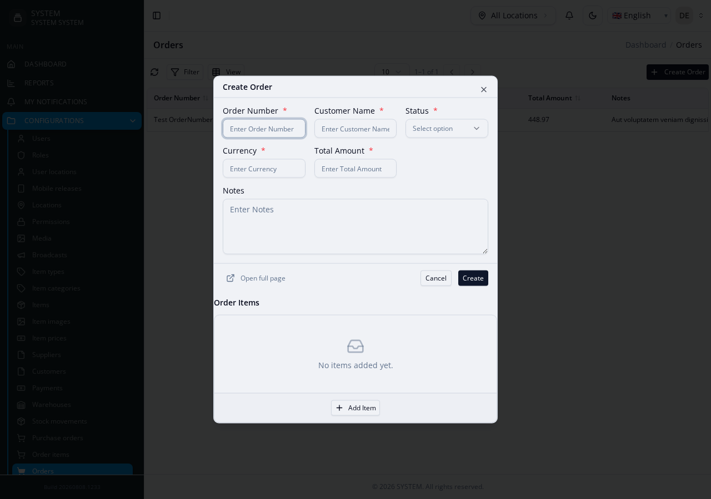
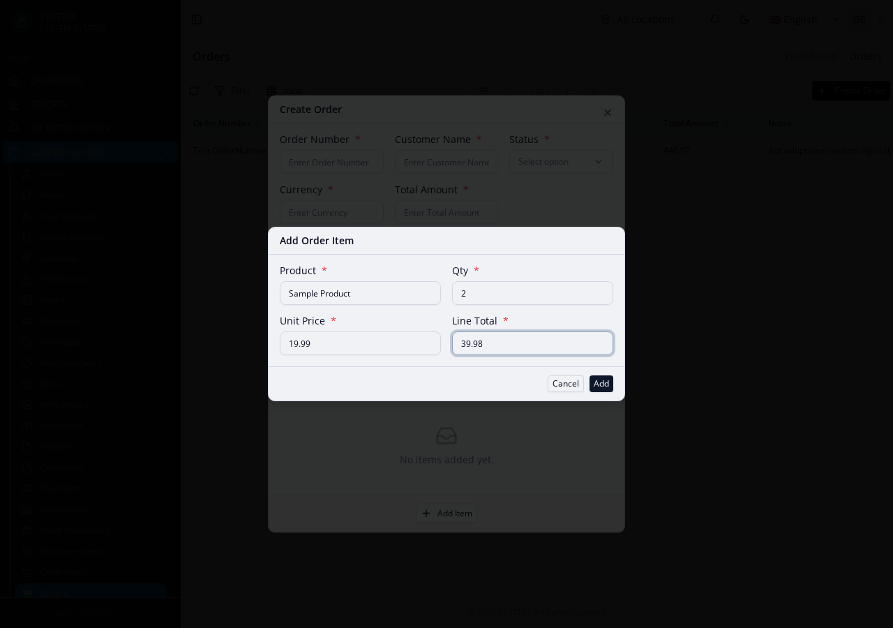
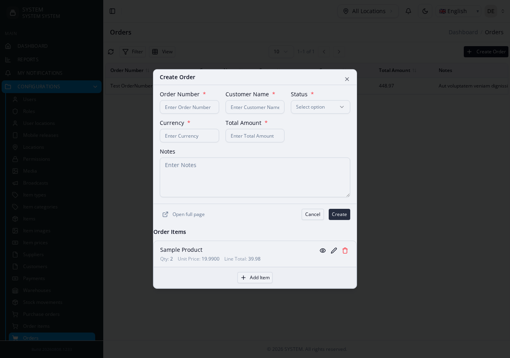

# Parent-Child Modules (`inline_items`)

A form where a parent record (an Order) is created/edited together with a
list of child rows (its Order Items) in the same UI, in one submit — not
two separate modules a user navigates between. See [Related-record tabs](delegations)
for the other, different, related-modules mechanism this engine has.

**Reference fixture:**
[`orders-suite`](https://github.com/joelnjoshkibona/generator-engine/tree/main/tests/Fixtures/integration-schemas/orders-suite) —
`Orders`/`OrderItems` — the canonical, fully-verified example.

`inline_items` is **not documented on the main [Module Config](../module-config)
reference page's top-level table** — it's entirely hand-authored, nothing
about it is introspected, so it's covered here instead.

## Building it

Follow the [generate → hand-edit → regenerate loop](index#the-generate-hand-edit-regenerate-loop):

1. Generate the child module **first** — this order is required, not just
   convenient: the parent's `inline_items` config (step 3) references the
   child's already-registered namespace, so the child module must exist
   before the parent's config can resolve it. It's an ordinary module
   generation on its own otherwise:
   ```bash
   php artisan make:module Custom/OrderItems
   ```
   See the pitfall below — this exact ordering has one known side effect
   worth knowing about before you hit it.
2. Generate the parent module:
   ```bash
   php artisan make:module Custom/Orders
   ```
3. Hand-edit the parent's `module.json`, adding an `inline_items` entry:
   ```json
   "inline_items": [{
     "key": "order_items",
     "label": "Order Items",
     "child_module": "OrderItems",
     "child_group": "Custom",
     "child_has_creator_updater": true,
     "parent_fk": "order_id",
     "primary_field": "product_name",
     "fields": [
       {"key": "product_name", "label": "Product", "type": "text", "required": true},
       {"key": "quantity", "label": "Qty", "type": "number", "required": true},
       {"key": "unit_price", "label": "Unit Price", "type": "number", "required": true, "decimals": 4}
     ],
     "inject_from_parent": [
       {"child_field": "currency", "parent_field": "currency"}
     ]
   }]
   ```
   `inline_items` is a **flat list** — not a map keyed by a group/label
   name. `child_has_creator_updater: true` is required if — as is the
   project's default convention — the child table has
   `created_by_id`/`updated_by_id` columns; omitting it when the child
   needs it fatal-errors on the first real create (found and fixed while
   building this fixture — see [Gotchas](gotchas)). `inject_from_parent` is
   optional — it copies a value straight from the parent model onto every
   child row at save time (here, the currency the order was placed in).
   If the child module itself lives under a nested sub-group (e.g.
   `Modules\System\Inventory\StockTransferItems`, not a bare top-level
   `Modules\Custom\{Child}`), also set `child_group_name` (StudlyCase or
   plain, `Str::studly()`-normalized) to that sub-group — e.g.
   `"child_group_name": "Inventory"`. Omitting it when the child needs it
   generates a namespace reference missing that segment, which fatal-errors
   the same way a missing `child_has_creator_updater` does.
4. Regenerate the parent with `--force` to pick up the hand-edited config:
   ```bash
   php artisan make:module Custom/Orders --force
   ```

## What you get

The Orders create form gets an "Order Items" section embedded below its own
fields, starting empty:



Clicking "Add Item" opens a modal for one child row — filled in and
submitted without ever leaving the parent Order's own create/edit form:



...and the row lands right back in the parent form, ready for the next one
or for the whole Order (parent + every child row) to be submitted together,
in one request:



- The Orders create/edit form gets an embedded, hand-edit-protected wrapper
  component (`OrdersOrderItemsInlineItems.vue`) rendering the child rows
  inline — written once, never touched by future regeneration, so you can
  freely add per-field logic (`dynamicDisabled`, `showField`, cross-field
  totals on `@item-change`) without it being clobbered by a later
  `--force`.
- `OrdersCreateService` saves every child row on create.
- `OrdersEditService` syncs on edit: rows removed from the form are
  deleted, rows matched by `uuid` are updated in place, new rows (no `uuid`
  yet) are inserted.
- `OrdersViewService` loads `order_items` alongside the parent record.
- `OrdersDeleteService` cascade-deletes every `order_items` row when the
  parent Order is deleted (respecting the child's own soft/hard delete
  mode automatically) — an inline_items child has no independent lifecycle
  by design, so cascading on parent delete is the same ownership rule
  applied once more.
- `OrdersDeleteCheckService`'s dependent-count check already flags
  `order_items` as a blocking dependent too — for free, via the same
  generic FK-graph naming-convention detection that covers any `*_id`
  column, entirely independent of the `inline_items` config above.

## Known limitation — the child's own FK relation can misresolve its namespace

Because the child (`OrderItems`) is scaffolded in step 1 while the parent
(`Orders`) doesn't exist anywhere yet, `OrderItemsModel`'s own generated
`order(): BelongsTo` relation has nothing to resolve `Orders`' real
namespace/module-type against, and silently guesses wrong (e.g. guesses
`Core\Orders\OrdersModel` when `Orders` is actually `Custom`-grouped) — a
different bug from anything else on this page, in the ordinary FK-relation
namespace resolver (`PathManager::resolveBackendModuleNamespace()`), not
the `inline_items`-specific namespace handling. Found live 2026-08-08.

There is no way to resolve this correctly at the moment `OrderItems` is
generated — `Orders` genuinely doesn't exist yet. **Fix: regenerate the
child once more, after the parent has been scaffolded:**

```bash
php artisan make:module Custom/OrderItems --force
```

A misresolved namespace does print a warning at generation time (routed
through `PathManager::reportIssue()` → the console's `$this->warn()`
output) — watch for a "not found in project or shell registry" message
after step 1 as the signal you'll need this extra regenerate.

See the fixture's own
[README](https://github.com/joelnjoshkibona/generator-engine/tree/main/tests/Fixtures/integration-schemas/orders-suite)
for the full verification steps this was actually tested against, including
confirming a `--force` regenerate preserves both `inline_items` itself and
a hand-edited wrapper component.
