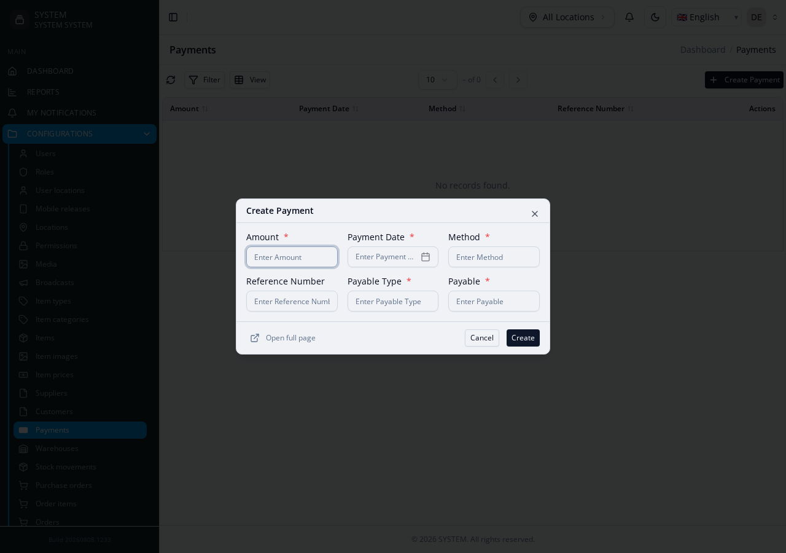

# Polymorphic Relationships (`morphs`)

A single table (e.g. Payments) that can belong to more than one kind of
parent (e.g. a Supplier payment or a Customer payment), instead of one
near-duplicate table per parent type.

**Reference fixture:**
[`morphs-suite`](https://github.com/joelnjoshkibona/generator-engine/tree/main/tests/Fixtures/integration-schemas/morphs-suite) —
`Payments` belongs to either `Suppliers` or `Customers`.

For the full `morphs` config shape, see the
[Module Config reference](../module-config#morphs-array).

## Fully schema-derived — no config editing at all

A column literally named `{prefix}_type` (string) paired with `{prefix}_id`
(integer), same prefix, is enough:

```php
$table->string('payable_type');
$table->unsignedBigInteger('payable_id');
// equivalently: $table->morphs('payable');
```

```bash
php artisan make:module Custom/Suppliers
php artisan make:module Custom/Customers
php artisan make:module Custom/Payments
```

Generation order doesn't matter here — unlike a normal FK, `morphTo()`
resolves its target at *runtime* (from whatever class name is stored in
`payable_type`), not at generation time, so there's no "referenced module
must already exist" requirement like a normal FK has.

## What you get

`PaymentsModel` gets a real `payable(): MorphTo { return $this->morphTo(); }`
method. If the migration is ever regenerated, it collapses back to a single
`$table->morphs('payable');` call (with no duplicate index — a real bug
found and fixed while building this fixture, see [Gotchas](gotchas)).

## What you get from the generated API (as of v2.44.0)

Before v2.44.0, `payable_type`/`payable_id` were excluded from
`PaymentsCreateService`'s validation rules and from the generated
`CreateForm.vue` entirely — the columns were correctly stripped from
list/filter/view UI (no generic renderer exists for "the related record
could be any of several types") but the same exclusion also silently
applied to create/edit, so a `POST /payments` through the generated API
dropped both fields before they ever reached `PaymentsModel::create()`
(Laravel's `validate()` only returns declared rule keys — this project's
mass-assignment convention). Creating a `Payment` via the HTTP API was
flatly impossible; only a direct `PaymentsModel::create([...])` call like
the one above worked.

Fixed in v2.44.0: `CreateService`/`EditService` now validate both columns
(`payable_type` → `required|string`, `payable_id` → `required|integer`,
deliberately no `exists:` rule since a polymorphic id can reference more
than one table). The rest of this page covers what the create/edit form
actually renders for them, which depends on whether `targets` is populated.

## Without `targets` populated — plain text/number inputs

`payable_type`/`payable_id` render as two plain inputs — a text input for
`payable_type` (the caller types/sends the raw FQCN, e.g.
`App\Project\Modules\Custom\Suppliers\SuppliersModel`, or a registered
morph-map alias) and a number input for `payable_id`. This is the fallback
for every module whose `morphs[].targets[]` is empty — including every
module generated before v2.51.0.



## With `targets` populated (v2.51.0+) — a real type-selector + record picker

Populate `targets` and regenerate to get a dropdown (pick the type) plus an
API-backed record picker scoped to whichever type is chosen, instead of the
plain inputs above:

```json
{
  "morphs": [
    {
      "name": "payable",
      "type_column": "payable_type",
      "id_column": "payable_id",
      "targets": [
        {
          "alias": "supplier",
          "model": "App\\Project\\Modules\\Custom\\Suppliers\\SuppliersModel",
          "module": "Suppliers",
          "label": "Supplier",
          "option_label": "contact_person"
        },
        {
          "alias": "customer",
          "model": "App\\Project\\Modules\\Custom\\Customers\\CustomersModel",
          "module": "Customers",
          "label": "Customer"
        }
      ]
    }
  ]
}
```

`targets` is never auto-guessed — hand-edit this into `Payments/module.json`
after the first generation, then `make:module Custom/Payments --force`.
Required keys: `alias`, `model`, `module`, `label`. Optional: `option_label`
— which field of the target record to show in the record picker's option
list (defaults to `name`; `contact_person` for Suppliers above). Only
affects the create/edit picker — see the next section for list/view.

This also generates a `Relation::morphMap()` registration — on `Payments`
itself (the model that owns `payable_type`/`payable_id`), not on `Suppliers`/
`Customers`:

```php
protected static function boot(): void
{
    parent::boot();
    Relation::morphMap([
        'supplier' => \App\Project\Modules\Custom\Suppliers\SuppliersModel::class,
        'customer' => \App\Project\Modules\Custom\Customers\CustomersModel::class,
    ]);
}
```

**Alias uniqueness is enforced.** `Relation::morphMap()` is a single
Laravel-global registry, not scoped per table — the same alias key can't
point at two different models. Registering a conflicting alias is a
hard-fail at generation time: `make:modules-from-db` checks every
`morphs[].targets[].alias` across the whole blueprint before generating
anything; `make:module` checks this run's aliases against every
already-generated sibling module's `module.json` on disk — narrower, since
it can only see modules that already exist (a documented limitation, not a
bug: two not-yet-generated modules that would conflict each still pass
individually until both exist and one is regenerated).

## Reverse relation + delegation tab on the target side (since v3.3.0)

**The inverse relationship is now available, opt-in per target.** By default,
only the owning side (`Payments`) gets a relationship method (`morphTo()`, or
nothing beyond the plain columns if `targets` is empty) — `Suppliers`/
`Customers` still do NOT automatically get a `payments(): MorphMany` just from
declaring `targets`. To get one, a caller explicitly invokes
`ModelRelationInjector` after both the owning module and the target module
already exist on disk:

```php
(new ModelRelationInjector('Vendors', 'System'))->injectMorphMany(
    'payments',                                                    // relation name
    'App\Project\Modules\System\AccountsPayments\Payments\PaymentsModel', // owning model FQCN
    'payable'                                                      // morph name
);
```

This splices a real `payments(): MorphMany` method onto `VendorsModel.php`'s
own file, at a permanent `// [[extraRelations]]` marker every `model.stub`
carries — idempotent, so re-running (e.g. after a `--force` re-scaffold) never
duplicates the method. Unlike `morphTo()` generation itself (order-independent
— resolves at runtime, not generation time), this genuinely needs the target
file to physically exist first, so it's meant to run as its own pass after a
full scaffold completes, not interleaved with module generation.

**A filtered delegation tab on the target's own view page** is a second,
independent piece — a delegation declared on the TARGET module (e.g. Vendors)
pointing at the OWNING module (Payments), with a new `morphFilter` key instead
of relying on `filterKey` alone:

```json
{
  "delegations": {
    "Vendors": [
      {
        "name": "Payments",
        "relatedModule": "Payments",
        "filterKey": "payable_id",
        "morphFilter": { "column": "payable_type", "value": "vendor" },
        "operations": { "list": { "enabled": true }, "view": { "enabled": true } }
      }
    ]
  }
}
```

`filterKey` alone would incorrectly match a PurchaseOrder or Expense whose id
happens to numerically collide with this vendor's, since `payable_id` is
shared across every polymorphic owner type — `morphFilter` adds the second,
constant `->where('payable_type', 'vendor')` clause every one of
`DelegationServiceGenerator`'s query-building methods needs. The frontend tab
itself needs no special handling — this is a plain `delegations` entry in
every other respect, so `DelegationTabComponentGenerator` renders it exactly
like any other tab. Scope it to `list`+`view` only in almost every real case:
Payments rows get created through their own dedicated flows (a wizard action
elsewhere), not from inside a vendor's own view page.

Neither piece is automatic just from populating `targets[].delegate` in
`module.json`/the blueprint — that key exists as documentation/config
bookkeeping for a consuming app's own orchestrator to read and act on (see
`morphs[].targets[].delegate` in `schema/module-config.schema.json` and
`schema/scaffold-blueprint.schema.json`); this package only provides the two
building blocks above, the same way it provides `ModelGenerator`/
`DelegationServiceGenerator` themselves without deciding when to call them.

**List/view rendering.** `payable_type`/`payable_id` are stripped from
list/filter/view UI entirely, with or without `targets` populated — no
generic renderer exists for "the related record could be any of several
types," and `option_label` only ever affects the create/edit record picker,
not how an existing record's polymorphic relation displays elsewhere.

See the fixture's own
[README](https://github.com/joelnjoshkibona/generator-engine/tree/main/tests/Fixtures/integration-schemas/morphs-suite)
for the full verification steps, including a real end-to-end Playwright pass
(type dropdown → record picker → submit → list) and the alias-conflict
hard-fail confirmed firing live.
